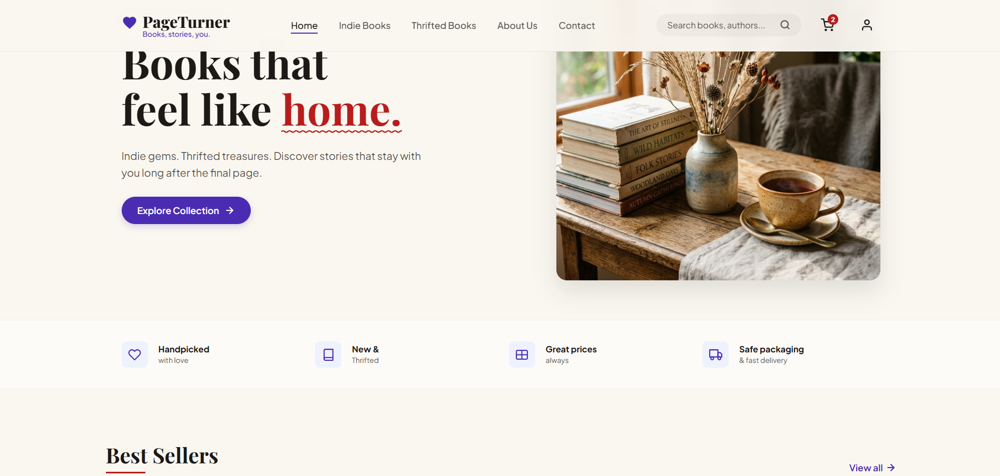
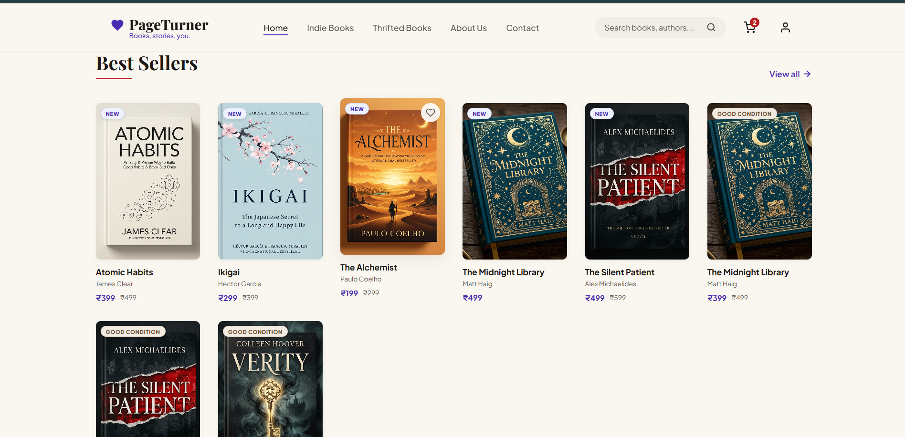
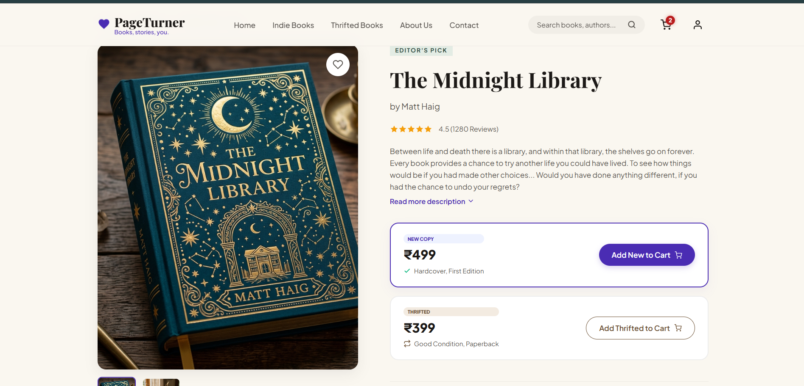
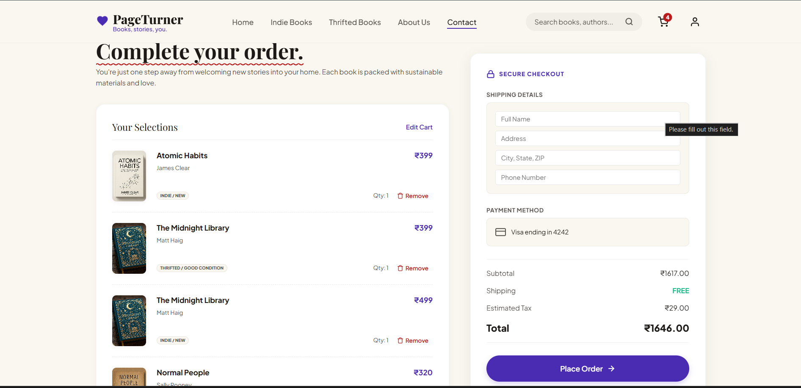

# PageTurner

A responsive online bookstore built using HTML, CSS, and JavaScript that allows users to browse books, explore detailed book pages, manage a shopping cart and wishlist, and experience a complete checkout flow.

## ✨ Features

- Browse indie and thrifted book collections
- Book search and filtering
- Detailed book information pages
- Shopping cart management
- Wishlist functionality
- Checkout and order confirmation
- Responsive user interface
- Local Storage support for cart persistence

## 🛠️ Tech Stack

- HTML5
- CSS3
- JavaScript
- Local Storage API
- Responsive Web Design

## 📂 Project Structure

```
index.html
book.html
thrifted.html
checkout.html
success.html
style.css
script.js
```

## 🚀 Live Demo

https://anushkaguptacg-a11y.github.io/pageturner/

## 📸 Screenshots

### Homepage


### Featured Books


### Book Details


### Checkout

## 🔮 Future Improvements

- User authentication
- Online payment integration
- Backend database
- Order history
- Product reviews and ratings
- Admin dashboard for inventory management

## 👩‍💻 Author

**Anushka Gupta**

GitHub: https://github.com/anushkaguptacg-a11y
